# Execution Plan

## Detailed Analysis Summary

### Change Impact Assessment
- **User-facing changes**: Yes — 12 new REST endpoints, authentication flows, task lifecycle management
- **Structural changes**: Yes — new application architecture (FastAPI, JSON file storage layer, JWT middleware)
- **Data model changes**: Yes — new User and Task data models with UUID-based identity
- **API changes**: Yes — 12 new endpoints across auth, tasks, and users resource groups
- **NFR impact**: Yes — JWT security, rate limiting, structured logging, Hypothesis PBT, health checks (3 extensions enabled)

### Risk Assessment
- **Risk Level**: Medium
- **Rollback Complexity**: Easy (greenfield; no existing data or integrations to undo)
- **Testing Complexity**: Moderate (PBT extension adds Hypothesis test generation; security rules add auth test coverage requirements)

---

## Workflow Visualization

### Mermaid Diagram

```mermaid
flowchart TD
    Start(["User Request"])

    subgraph INCEPTION["INCEPTION PHASE"]
        WD["Workspace Detection\nCOMPLETED"]
        RE["Reverse Engineering\nSKIPPED"]
        RA["Requirements Analysis\nCOMPLETED"]
        US["User Stories\nCOMPLETED"]
        WP["Workflow Planning\nIN PROGRESS"]
        AD["Application Design\nEXECUTE"]
        UG["Units Generation\nEXECUTE"]
    end

    subgraph CONSTRUCTION["CONSTRUCTION PHASE - Per Unit"]
        FD["Functional Design\nEXECUTE"]
        NFRA["NFR Requirements\nEXECUTE"]
        NFRD["NFR Design\nEXECUTE"]
        ID["Infrastructure Design\nEXECUTE"]
        CG["Code Generation\nEXECUTE"]
        BT["Build and Test\nEXECUTE"]
    end

    subgraph OPERATIONS["OPERATIONS PHASE"]
        OPS["Operations\nPLACEHOLDER"]
    end

    Start --> WD
    WD -.-> RE
    WD --> RA
    RE --> RA
    RA --> US
    US --> WP
    WP --> AD
    AD --> UG
    UG --> FD
    FD --> NFRA
    NFRA --> NFRD
    NFRD --> ID
    ID --> CG
    CG -.->|Next Unit| FD
    CG --> BT
    BT -.-> OPS
    BT --> End(["Complete"])

    style WD fill:#4CAF50,stroke:#1B5E20,stroke-width:3px,color:#fff
    style RA fill:#4CAF50,stroke:#1B5E20,stroke-width:3px,color:#fff
    style US fill:#4CAF50,stroke:#1B5E20,stroke-width:3px,color:#fff
    style WP fill:#4CAF50,stroke:#1B5E20,stroke-width:3px,color:#fff
    style CG fill:#4CAF50,stroke:#1B5E20,stroke-width:3px,color:#fff
    style BT fill:#4CAF50,stroke:#1B5E20,stroke-width:3px,color:#fff
    style RE fill:#BDBDBD,stroke:#424242,stroke-width:2px,stroke-dasharray: 5 5,color:#000
    style OPS fill:#BDBDBD,stroke:#424242,stroke-width:2px,stroke-dasharray: 5 5,color:#000
    style AD fill:#FFA726,stroke:#E65100,stroke-width:3px,stroke-dasharray: 5 5,color:#000
    style UG fill:#FFA726,stroke:#E65100,stroke-width:3px,stroke-dasharray: 5 5,color:#000
    style FD fill:#FFA726,stroke:#E65100,stroke-width:3px,stroke-dasharray: 5 5,color:#000
    style NFRA fill:#FFA726,stroke:#E65100,stroke-width:3px,stroke-dasharray: 5 5,color:#000
    style NFRD fill:#FFA726,stroke:#E65100,stroke-width:3px,stroke-dasharray: 5 5,color:#000
    style ID fill:#FFA726,stroke:#E65100,stroke-width:3px,stroke-dasharray: 5 5,color:#000
    style INCEPTION fill:#BBDEFB,stroke:#1565C0,stroke-width:3px,color:#000
    style CONSTRUCTION fill:#C8E6C9,stroke:#2E7D32,stroke-width:3px,color:#000
    style OPERATIONS fill:#FFF59D,stroke:#F57F17,stroke-width:3px,color:#000
    style Start fill:#CE93D8,stroke:#6A1B9A,stroke-width:3px,color:#000
    style End fill:#CE93D8,stroke:#6A1B9A,stroke-width:3px,color:#000

    linkStyle default stroke:#333,stroke-width:2px
```



### Text Alternative

```
INCEPTION PHASE
  - Workspace Detection      [COMPLETED]
  - Reverse Engineering      [SKIPPED - Greenfield]
  - Requirements Analysis    [COMPLETED]
  - User Stories             [COMPLETED]
  - Workflow Planning        [IN PROGRESS]
  - Application Design       [EXECUTE]
  - Units Generation         [EXECUTE]

CONSTRUCTION PHASE (per unit)
  - Functional Design        [EXECUTE]
  - NFR Requirements         [EXECUTE]
  - NFR Design               [EXECUTE]
  - Infrastructure Design    [EXECUTE]
  - Code Generation          [EXECUTE - ALWAYS]
  - Build and Test           [EXECUTE - ALWAYS]

OPERATIONS PHASE
  - Operations               [PLACEHOLDER]
```

---

## Phases to Execute

### INCEPTION PHASE
- [x] Workspace Detection — COMPLETED
- [x] Reverse Engineering — SKIPPED (Greenfield, no existing code)
- [x] Requirements Analysis — COMPLETED
- [x] User Stories — COMPLETED (22 stories, 5 epics)
- [x] Workflow Planning — IN PROGRESS

- [ ] **Application Design — EXECUTE**
  - *Rationale*: New application with multiple service components (Auth, Task, User, Storage layer). Component methods, service layer contracts, and inter-component dependencies need to be defined before code generation. New FastAPI project requires deliberate layering (routes → services → repository).

- [ ] **Units Generation — EXECUTE**
  - *Rationale*: The API has two distinct, independently implementable units: (1) Authentication (user registration, JWT issuance/validation, logout/blacklist) and (2) Task Management (CRUD, priority, status, due date, category, tags, assignment, filtering). Separating into units allows focused design and code generation per concern.

### CONSTRUCTION PHASE (per unit)

- [ ] **Functional Design — EXECUTE** (per unit)
  - *Rationale*: Each unit has new data models (User, Task), business rules (ownership/authorization checks, status transitions, priority defaults), and complex logic (JWT validation, task filtering). PBT-01 requires testable properties to be identified during Functional Design.

- [ ] **NFR Requirements — EXECUTE** (per unit)
  - *Rationale*: Three extensions are enabled (Security, Resiliency, PBT). Tech stack decisions must be locked down: Hypothesis (PBT-09), bcrypt/argon2 (SECURITY-12), rate limiting strategy (SECURITY-11 + FR-10), structured logging format (SECURITY-03), health check approach (RESILIENCY-06). RESILIENCY-04 CI/CD decisions also scoped here.

- [ ] **NFR Design — EXECUTE** (per unit)
  - *Rationale*: NFR patterns must be incorporated into design: JWT middleware, rate limiter middleware, global error handler, structured logger, health endpoint. These cross-cut both units and need design specification before code generation.

- [ ] **Infrastructure Design — EXECUTE** (per unit, minimal scope)
  - *Rationale*: Local infrastructure must be designed: JSON file storage paths, environment variable schema (.env), server startup configuration, data directory layout. Minimal scope but required to ensure code generation targets are concrete.

- [ ] **Code Generation — EXECUTE** (ALWAYS, per unit)
  - *Rationale*: Implementation planning and code generation for both units, including PBT tests (Hypothesis), example-based tests (pytest), and security-compliant implementation.

- [ ] **Build and Test — EXECUTE** (ALWAYS)
  - *Rationale*: Build instructions, unit test execution, integration test execution, and PBT seed-logged CI instructions required.

### OPERATIONS PHASE
- [ ] Operations — PLACEHOLDER (future deployment and monitoring)

---

## Proposed Units of Work

### Unit 1: Authentication
**Scope**: User registration, login, JWT issuance, token validation middleware, logout/blacklist, password hashing

**Stories covered**: US-01, US-02, US-03, US-04

**Key deliverables**:
- `POST /auth/register` endpoint
- `POST /auth/login` endpoint
- `POST /auth/logout` endpoint
- JWT middleware (applied to all protected routes)
- User JSON repository
- bcrypt/argon2 password hashing
- Token blacklist (in-memory or file-backed)

### Unit 2: Task Management
**Scope**: Task CRUD, priority/status/due-date/category/tags management, user assignment, basic filtering

**Depends on**: Unit 1 (JWT middleware)

**Stories covered**: US-05 through US-22

**Key deliverables**:
- `GET/POST /tasks` endpoints
- `GET/PUT/PATCH/DELETE /tasks/{id}` endpoints
- `GET /users`, `GET /users/{id}` endpoints
- Task JSON repository
- Filtering logic (status, priority, due_date)
- Rate limiting middleware (applies to all endpoints)
- `GET /health` endpoint

---

## Success Criteria
- **Primary Goal**: Fully functional Task Manager REST API in Python/FastAPI with JWT authentication, complete task lifecycle management, and JSON file persistence
- **Key Deliverables**:
  - Working API with all 12 endpoints
  - JWT-secured authentication
  - Task CRUD with priorities, statuses, due dates, categories, tags
  - Task assignment between users
  - Basic filtering
  - Hypothesis PBT + pytest test suite
  - Security-compliant implementation (all 15 SECURITY rules)
- **Quality Gates**:
  - All example-based tests pass
  - All Hypothesis PBT tests pass with seed logging
  - No hardcoded secrets
  - Global error handler returns no stack traces
  - Structured JSON logging with no PII
  - Health endpoint returns 200
